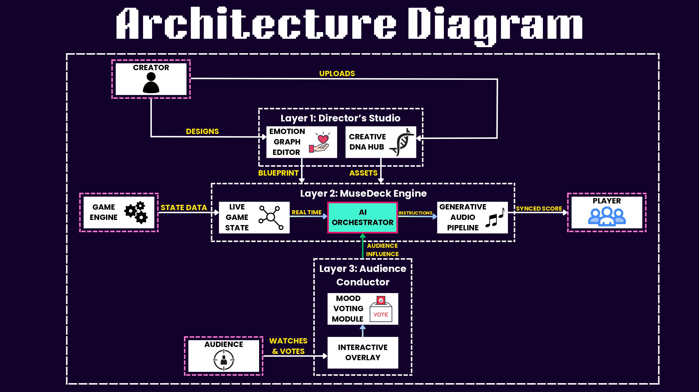

# AURA Engine: Adaptive Unison-Response Audio Engine

AURA is not just a dynamic soundtrack system; it's a comprehensive framework for creating real-time, emotionally-aware generative and adaptive audio experiences. Developed for the Samsung GenAI Hackathon, AURA showcases how multi-modal inputs can transform a static piece of music into a living, breathing score that perfectly matches the on-screen action and the user's emotional state.

The project is demonstrated through two powerful, distinct pillars:
1.  **A Standalone Pygame Engine** featuring advanced on-device adaptive and generative music algorithms.
2.  **A Web-based SDK Framework** that uses multi-modal sensor data (face, voice, game state) to modulate music for web clients, illustrating a broader, extensible use case.

The core purpose is to demonstrate a technology that could be integrated into Samsung devices, enabling applications to generate personalized soundtracks for user-generated content, such as vacation videos, by analyzing scene content and emotional cues.

## 🌟 Core Concepts & Features

### Pillar 1: The Extensible Pygame Engine

This is a complete, playable 2D RPG-style game built with Pygame that serves as a powerful showcase for on-device music generation. When you launch the game, you can choose from three distinct music modes:

1.  **Linear Music:** A standard, static background track that loops, representing the traditional approach to game audio.

2.  **Adaptive Music:** A system that dynamically crossfades between different pre-composed music tracks based on the in-game state. It intelligently transitions between `Exploration`, `Close to Enemy`, and intense `Battle` themes, creating a responsive but finite soundscape.

3.  **Generative Music (Markov Chains):** This is the heart of our GenAI implementation. Instead of playing pre-made tracks, the engine generates a continuous, non-repetitive musical score in real-time based on chord progressions modeled as a **Markov Chain**.
    -   **State-Based Transition Matrices:** We have defined two distinct probabilistic transition matrices: one for a `Calm` state (exploration) and one for a `High-Tension` state (combat).
    -   **Real-time Chord Progression:** The game engine tracks the player's state. When in a "calm" state, it generates the next chord using the calm matrix. When a battle begins, it seamlessly switches to the tension matrix, producing a more dramatic and dissonant progression.
    -   **Infinite Variety:** This ensures that every playthrough has a unique, procedurally generated soundtrack that is perfectly synchronized with the player's actions.

### Pillar 2: The AURA Web SDK Framework

To demonstrate the broader applicability of this technology, we built a web-based framework that externalizes the sensing and modulation.

-   **Multi-Modal Emotion Sensing:** AURA aggregates data to build a comprehensive emotional profile.
    -   **In-Game State:** Monitors metrics from a simple web-based game client.
    -   **Facial & Speech Recognition:** Uses Python sensor modules with DeepFace and Librosa to analyze the user's webcam and microphone feeds.
    -   **Audience Interaction:** A web-based polling system for live engagement.
-   **Intelligent Emotion Orchestrator:** A central weighting system processes these inputs into a final "Emotion Vector" (Tension, Excitement, Fear, Joy, Calm).
-   **Director's Studio UI:** A React-based dashboard to visualize all data streams, upload custom "Music DNA" tracks, and even generate new music using an integrated Magenta.js AI model.

### The Broader Vision: Beyond Gaming

This project serves as a proof-of-concept for a versatile SDK that could be integrated into Samsung devices. Imagine a "Video Soundtrack Generator" app:
1.  A user uploads a vacation video.
2.  The SDK analyzes the video frame-by-frame, identifying scenes (a calm beach, a lively party, a tense hike).
3.  It uses this state analysis to drive the generative music engine, creating a custom, royalty-free soundtrack that perfectly matches the mood and pacing of the user's personal memories.

## 🗂 System Architecture Diagram



## 💻 Tech Stack

-   **Pygame Engine:** Python, Pygame, NumPy (for Markov Chains), Librosa
-   **Backend (Web SDK):** Python, FastAPI, WebSockets, PyDub
-   **Frontend (Web SDK):** React, Vite, Recharts, Magenta.js
-   **Sensor Modules:** Python, OpenCV, DeepFace, PyAudio, Scikit-learn

## 🚀 Getting Started: Local Setup

Follow these instructions to set up and run the entire project locally.

### Prerequisites

-   Git
-   Python 3.8+ and `pip`
-   Node.js and `npm`
-   A **Webcam** and **Microphone** connected to your machine.

### Step 1: Clone Repository & Install Dependencies

First, clone the project and install all required Python and Node.js packages.

```bash
# Clone the repository
git clone https://github.com/Samsung-Team-AURA/AURA
cd AURA

# Set up a Python virtual environment
python -m venv venv
source venv/bin/activate  # On Windows, use `venv\Scripts\activate`

# Install all Python packages
pip install -r requirements.txt

# Install all Node.js packages for the frontend
cd aura_frontend
npm install
cd ..
```

### Step 2: Run the Services

You will need **five separate terminal windows** to run all components of the project. Make sure you have activated the Python virtual environment in the terminals used for the backend and sensors.

**Terminal 1: Run the AURA Backend**

```bash
# In the project's root directory
cd aura_backend
uvicorn app.main:app --host 0.0.0.0 --port 8000 --reload
```

**Terminal 2: Run the AURA Frontend**

```bash
# In the project's root directory
cd aura_frontend
npm run dev
```
*(The Director's Studio will now be available at `http://localhost:5173`)*

**Terminal 3: Run the Face Emotion Sensor**

```bash
# In the project's root directory
python sensor_modules/face_emotion_sender.py
```

**Terminal 4: Run the Speech Emotion Sensor**

```bash
# In the project's root directory
python sensor_modules/speech_emotion_sender.py
```

**Terminal 5: Run the Pygame Client**

```bash
# In the project's root directory
cd pygame_and_sdks_extensible
python game_runner.py
```

### How to Use AURA

You can now experience the two main pillars of the project.

**Flow A: Experiencing the Pygame Generative Music Engine**

1.  Focus on the Pygame window that launched from **Terminal 5**.
2.  In the main menu, use your mouse to select **"Linear"**, **"Adaptive"**, or **"Generative"**.
3.  Click **"Play"**.
4.  Play the game using **W, A, S, D** to move and **Mouse Click** for magic attacks.
5.  Listen carefully to how the music behaves in each mode. Notice the dynamic transitions in Adaptive mode and the ever-changing, non-repetitive score in Generative mode as you enter and leave combat.

**Flow B: Experiencing the AURA Web SDK Framework**

1.  Make sure all services from Terminals 1-4 are running.
2.  Open the **Director's Studio** in your browser: `http://localhost:5173`.
3.  **Upload Music DNA:** Use the "Music DNA" panel to upload an audio file or use the "AI Music Generator" to create one and upload it.
4.  **Start Music:** Click the "Start Music" button in the "Adaptive Music" panel.
5.  **Launch the Web Game:** Open a new browser tab to `http://localhost:8000/game`.
6.  **Interact:** Play the web game while speaking and emoting. Observe the Director's Studio to see all data streams update in real-time and listen as the music's tempo and feel are modulated.

## 🎯 Value Proposition for Stakeholders

AURA is more than a technical demonstration; it's a flexible framework designed for real-world commercial applications. Our technology offers distinct advantages for different sectors of the interactive entertainment and content creation industries.

### For Game Studios & Interactive Media Developers

Static, looping soundtracks can quickly become repetitive, breaking player immersion and making extended play sessions feel monotonous. AURA offers a powerful toolkit to create deeply dynamic and endlessly replayable audio experiences that keep players engaged.

-   **Elevate Player Immersion:** Our adaptive and generative engines perfectly synchronize the musical score to gameplay intensity—from tense exploration to chaotic combat. This creates a powerful emotional feedback loop that makes game worlds feel more alive and responsive.

-   **Unprecedented Replay Value:** The Markov Chain generative engine ensures that the soundtrack is procedurally created in real-time. This means no two playthroughs will ever sound exactly the same, providing a fresh auditory experience every time a player starts a new game.

-   **Accelerated Content Creation & Cost Savings:** The integrated AI Music Generator (Magenta.js) allows developers to rapidly prototype and generate unique, royalty-free musical themes and motifs. This can significantly reduce music licensing costs and production time, especially for indie studios.

-   **Flexible Integration:** The project's standalone Pygame engine serves as a direct proof-of-concept, demonstrating that the core logic can be adapted as a library or SDK into existing game engines (Unity, Unreal, Godot, etc.) to drive their native audio systems.

### For the Broader Entertainment & Content Creation Industry

The true power of AURA lies in its adaptability beyond gaming. The web SDK framework demonstrates a portable, state-based engine that can create responsive audio for a vast range of applications.

-   **Personalized Soundtracks for User-Generated Content:** This is a killer feature for mobile devices. Imagine a user records a video of their vacation. The AURA engine could be integrated into a video editing app to analyze the video content for scene changes (e.g., calm beach, lively party, tense hike) and automatically generate a bespoke, royalty-free soundtrack that perfectly matches the mood and pacing of their personal memories.

-   **Dynamic Atmosphere for Live & Theatrical Experiences:** AURA's ability to process real-time inputs (like audience polls or even ambient noise levels) can be used to modulate the atmosphere in theaters, concerts, or interactive installations, creating unique experiences for every audience.

-   **Enhanced Brand Engagement:** The engine can be used to create adaptive audio for websites and digital marketing campaigns. The music could react to user scrolling, clicks, or time spent on a page, creating a more engaging and memorable brand interaction.

-   **A Core SDK for Next-Generation Devices:** The AURA engine is designed to be a foundational technology. It could be integrated as a core SDK on Samsung devices (mobiles, tablets, smart TVs), empowering a whole ecosystem of third-party applications to build their own unique, emotionally-aware experiences on the platform.

## 🎬 Submissions

Here you can find links to our project presentation and video demonstration for the hackathon.

-   **Presentation Slides:** https://drive.google.com/file/d/1oZ8Mbxv9V6qrmA7VMkRvia_kFNMb5hlH/view?usp=sharing
-   **Video Demonstration:** https://drive.google.com/file/d/1vHrRJB92z2Yp6zg6F3SslQs_WPMFGCWn/view?usp=sharing